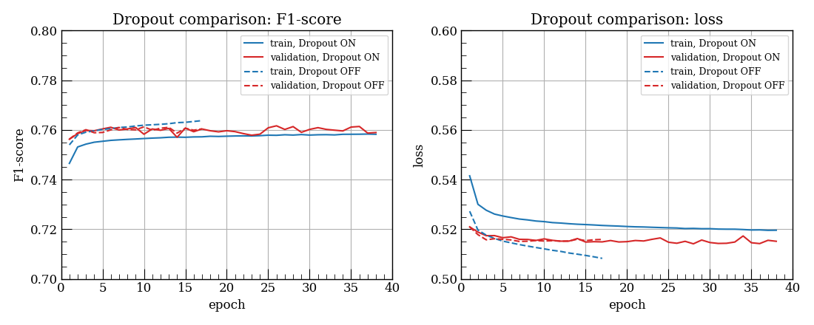

# Technical Report: Dropout Ablation for E90ML

**Experiment date:** 1 August 2026

**Software:** Python 3.10, PyTorch 2.13.0, scikit-learn 1.7.2

**Environment:** macOS on Apple Silicon, PyTorch MPS backend

## 1. Purpose of this study

In the initial E90ML study, validation loss was lower and validation F1-score was higher than the corresponding training values, contrary to the usual ordering.

This study examined whether that inversion resulted from the different network modes used during training and validation when Dropout was enabled. Two otherwise identical training runs, with and without Dropout, were compared.

## 2. Method

### 2.1 Compared conditions

| Condition | Dropout rate | Configuration |
|---|---:|---|
| Dropout ON | 0.2513583424 (tuned) | `param/usr/v1_mac_demo.yaml` |
| Dropout OFF | 0.0 | `experiments/dropout_ablation/config_dropout_off.yaml` |

The Dropout ON rate was obtained from the Optuna study used for the baseline model. The Dropout OFF configuration inherited the baseline experimental settings and set only `training.dropout_rate_override` to `0.0`; output paths were changed to preserve the baseline artifacts.

### 2.2 Metric collection

Training loss and F1-score were accumulated from optimization batches in `model.train()` mode. BatchNorm used mini-batch statistics in both conditions; the Dropout ON run additionally applied random activation masking.

Validation metrics were computed at the end of each epoch using `model.eval()` and `torch.inference_mode()`. Dropout was disabled, BatchNorm used its accumulated running statistics, and the checkpoint with the minimum validation loss was saved.

### 2.3 Data partitioning

The final validation partition was reserved before tuning, and the tuning sample was drawn only from the remaining training pool. Rows with identical model inputs and labels were grouped so that exact duplicates did not cross a training/validation boundary. The recorded summaries reported zero overlapping groups in both the final split and the inner split used for tuning. The independent test sample was loaded from a separate file and was not used for tuning, training, or validation.

## 3. Results



| Condition | Selected epoch | Minimum validation loss | Stopping epoch |
|---|---:|---:|---:|
| Dropout ON | 28 | 0.5141 | 38 |
| Dropout OFF | 7 | 0.5151 | 17 |

With Dropout ON, training loss remained above validation loss throughout training, and training F1-score was lower than validation F1-score in almost every epoch. With Dropout OFF, the same ordering appeared during the first few epochs. Thereafter, training loss fell below validation loss, and training F1-score rose above validation F1-score.

The Dropout OFF run showed mild overfitting after its selected epoch: training metrics continued to improve while validation performance saturated. Early stopping terminated the run at epoch 17 and restored the epoch-7 checkpoint.

## 4. Discussion

Disabling Dropout removed the persistent inversion while the validation curves remained similar. This controlled comparison supported training-time Dropout as the primary explanation for the inversion.

A small inversion remained during the first few Dropout OFF epochs. Training metrics were online averages collected while the weights changed within an epoch, whereas validation used the final weights from that epoch. Even without Dropout, BatchNorm used mini-batch statistics during training and running statistics during validation. Together, these evaluation differences may have caused the temporary inversion during the initial epochs. However, they could not explain the persistent inversion observed with Dropout ON because the conventional ordering emerged in the Dropout OFF run while the same metric collection and BatchNorm modes were still used.

Together with the recorded split checks, these results indicated that the inversion could be explained without invoking data leakage or improper partitioning.

## 5. Conclusion

Under otherwise identical conditions, disabling Dropout restored the expected ordering after the initial epochs. The persistent inversion was therefore attributed primarily to Dropout being active when training metrics were collected but disabled during validation. Online metric averaging and the different BatchNorm statistics may have contributed to the small initial inversion that remained without Dropout.

## 6. Reproduction and artifacts

The experiment directory contains the report configuration, a non-conflicting demo configuration, the runner, and the comparison code. Set up the environment and ROOT input data as described in the [main README](../../README.md), then run from the repository root:

```bash
bash experiments/dropout_ablation/run_experiment.sh
```

The runner retrains and evaluates the Dropout OFF model, then rebuilds the comparison figure using its new history and the tracked Dropout ON history. It does not retrain the Dropout ON model.
