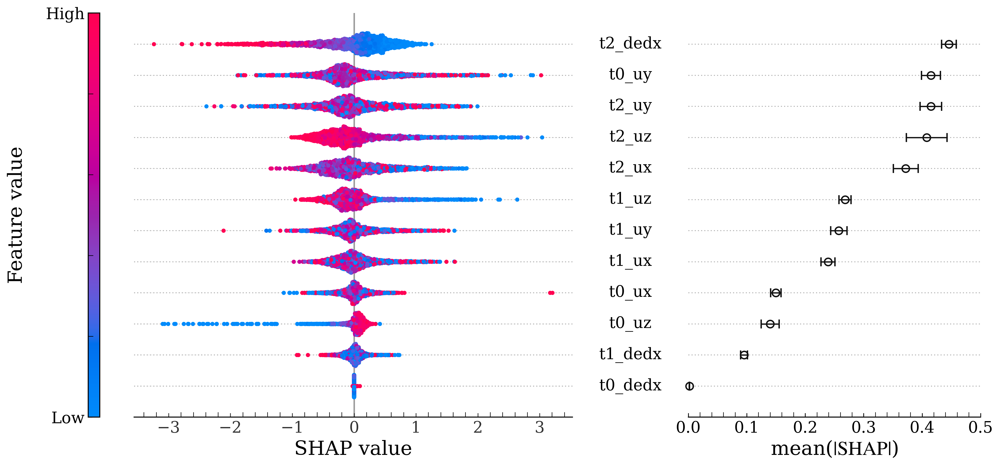

# Model explanation

`explain.py` computes SHAP distributions and global feature importance for the tracked `ptep_demo` model. It is intentionally separate from the standard pipeline because SHAP is an optional, comparatively expensive post-training analysis.

The analysis uses the three training-source ROOT files to construct a fixed 1% sampling pool. For each seed in `(7, 21, 42, 90, 2026)`, it draws 200 background events and 500 explained events without replacement. The publication-oriented beeswarm pools the five equal-size explanations, while global importance is reported as the mean and standard deviation of `mean(|SHAP|)` across the five sampling seeds. These are SHAP sampling seeds; assessing training-seed
dependence would require retraining multiple models.

Required tracked artifacts:

- `param/tune/ptep_demo.json`;
- `param/pth/ptep_demo.pth`;
- `param/pth/ptep_demo.pkl`.

Run from the repository root:

```bash
python experiments/model_explanation/explain.py
```

The principal outputs are written to `plots/explain/`, and the seed-wise importance table is written to
`data/output/ptep_demo_shap_seed_stability.csv`.

## Result

The left panel shows the pooled SHAP-value distributions, with color indicating the original feature value. The right panel shows the mean and standard deviation of `mean(|SHAP|)` across the five sampling seeds.


