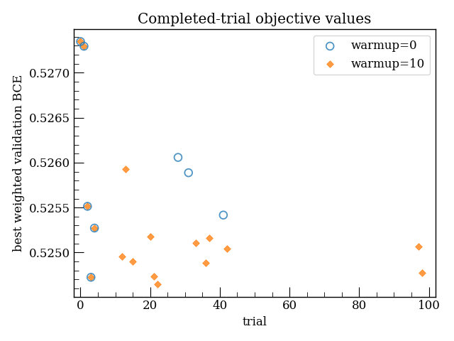
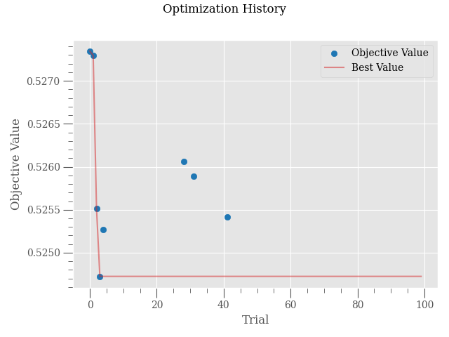
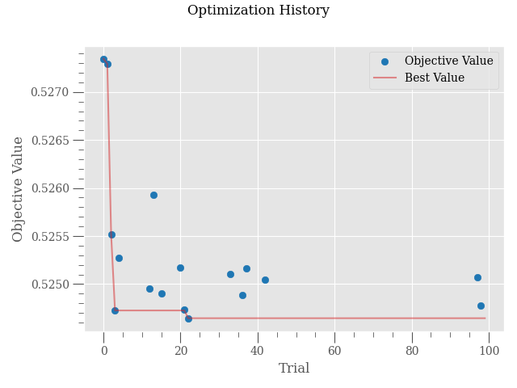
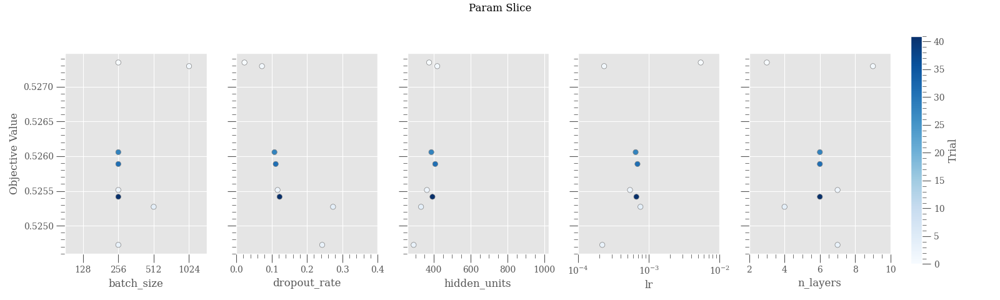
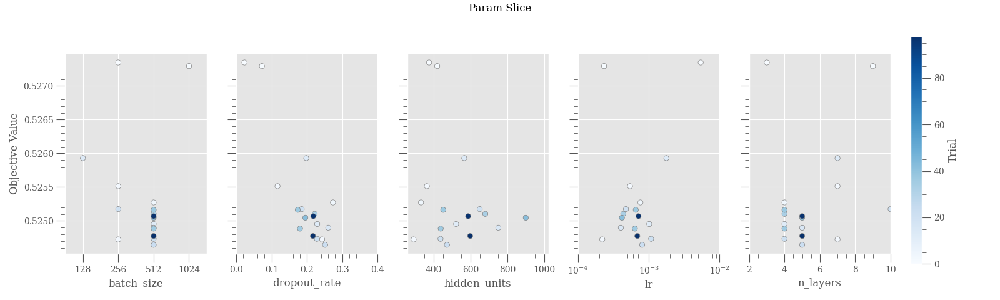

# Technical Report: Selecting the MedianPruner Warmup for E90ML

**Experiment date:** 31 July 2026

**Software:** Python, PyTorch 2.13.0, Optuna 4.9.0, scikit-learn 1.7.2

**Environment:** macOS on Apple Silicon, PyTorch MPS backend

## 1. Purpose of this study

The E90ML hyperparameter search trains a multilayer perceptron for up to 100 epochs per trial. Optuna's `MedianPruner` reduces this cost by stopping trials whose intermediate validation loss is unpromising. The setting examined here, `n_warmup_steps`, determines how many initial epochs are protected from
pruning.

This choice matters because an epoch is not an equal computational or
optimization budget across batch sizes. The tuning inner-training partition
contains 356,536 events. Ignoring only the final partially filled batch, the
approximate number of optimizer updates in one epoch is therefore:

| Batch size | Updates per epoch | Updates by epoch 10 |
|---:|---:|---:|
| 128 | 2,786 | 27,860 |
| 256 | 1,393 | 13,930 |
| 512 | 697 | 6,970 |
| 1024 | 349 | 3,490 |

Thus, pruning after epoch 1 can compare a batch-128 trial after about 2,786 parameter updates with a batch-1024 trial after only about 349. This difference is an intentional property of fixed-epoch training—the final training also uses 100 epochs—but it makes a decision based on the first epoch especially sensitive to early learning dynamics. Learning rate, network depth, Dropout, and still-developing BatchNorm statistics add further variation.

This experiment asks whether delaying pruning for ten epochs gives a more
reliable search than Optuna's zero-warmup default, and whether that benefit is worth the additional runtime. Two otherwise identical 100-trial studies were therefore compared:

- `n_warmup_steps=0`: pruning can begin after epoch 1;
- `n_warmup_steps=10`: epochs 1–10 are protected, so pruning can begin after epoch 11.

## 2. Method

### 2.1 Common Optuna configuration

Both studies used `TPESampler(seed=42)` and minimized validation loss. Except for `n_warmup_steps`, `MedianPruner` retained its Optuna 4.9.0 defaults:

```text
n_startup_trials = 5
interval_steps   = 1
n_min_trials     = 1
```

There are two distinct startup settings here. `MedianPruner`'s `n_startup_trials=5` prevents pruning until five trials have finished, whereas the TPE sampler's default `n_startup_trials=10` uses random sampling for its first ten trials. With the same sampler seed, trials 0–9 therefore had identical hyperparameters in the two studies. This was verified directly from the stored Optuna trials. Trials 0–4 completed because of the pruner startup; trials 5–9 were eligible for pruning and were pruned in both studies, although warmup 10 allowed them to run for more epochs. After trial 9, the different pruning histories changed the observations available to TPE, so the suggested configurations diverged. Later trials therefore compare the complete optimization policies rather than paired configurations.

### 2.2 Data sampling

The final validation set was first reserved from the full development sample.
Tuning data were drawn only from the remaining outer-training partition and
then divided into grouped inner-training and inner-validation sets. Identical
feature/label event groups were kept in one partition; the recorded overlap was zero. The scaler was fitted only to inner-training data.

The binary model labels are:

- **Signal:** `SigmaNCusp`.
- **Background:** `QFLambda` and `QFSigmaZ`.

| Partition | Events | Background | Signal |
|---|---:|---:|---:|
| Inner training | 356,536 | 206,604 | 149,932 |
| Inner validation | 88,903 | 51,617 | 37,286 |
| Reserved final validation | 2,224,798 | 1,289,882 | 934,916 |

### 2.3 Model, search space, and objective

`model.train()` was used in training. `model.eval()` was used with
`torch.inference_mode()` in validation, so Dropout was disabled and BatchNorm used its running statistics.

| Hyperparameter | Search range |
|---|---|
| Batch size | {128, 256, 512, 1024} |
| Hidden layers | Integer 2–10 |
| Hidden units per layer | Integer 256–1024 |
| Dropout rate | Continuous 0.0–0.4 |
| Adam learning rate | Log-uniform 1e-4–1e-2 |

The objective was the best validation weighted-BCE loss observed during a
trial. The positive-class weight was calculated from the inner-training set:

```text
pos_weight = 206,604 / 149,932 ≈ 1.3780
objective  = minimum validation loss across evaluated epochs
```

## 3. Results

### 3.1 Overall comparison

| Metric | Warmup 0 | Warmup 10 |
|---|---:|---:|
| Total trials | 100 | 100 |
| Complete trials | 8 | **17** |
| Pruned trials | 92 | 83 |
| Completion rate | 8% | **17%** |
| Best validation loss | 0.5247249 | **0.5246443** |
| Median completed-trial loss | 0.5257007 | **0.5250692** |
| Aggregate trial runtime | **1.88 h** | 6.21 h |

Warmup 10 more than doubled the number of completed trials. Its best objective was lower by 0.0000806 (~0.015% relative), too small to claim a meaningful performance gain from a single seeded comparison. However, the important difference is instead the larger body of completed evidence available to TPE and to the investigator.



The figure intentionally shows completed-trial objectives only. A point's
horizontal position is its Optuna trial number; missing trial numbers were
pruned. Warmup 0 retained only eight completed observations, whereas warmup 10 retained seventeen and continued to produce competitive completed trials late in the study.

### 3.2 Optimization histories

`n_warmup_steps=0`:



`n_warmup_steps=10`:



With zero warmup, the best completed objective was found very early and the history then remained flat, while few later trials completed. With ten epochs of warmup, the best value improved around trial 22 and additional near-optimal completed trials appeared near the end of the study. This does not prove that warmup improves the attainable optimum, but it shows that the conclusion is supported by a less sparse history.

### 3.3 Parameter slices

`n_warmup_steps=0`:



`n_warmup_steps=10`:



The zero-warmup slices are sparse because only eight trials completed. In particular, six of the eight completed observations used batch size 256 and no batch-128 trial completed. Warmup 10 provides visibly denser coverage and includes a completed trial at every batch size. Its TPE trajectory concentrated mainly around batch size 512 and moderate Dropout, but these adaptive samples must not be interpreted as a controlled one-variable comparison.

The exact batch-size coverage was:

| Batch size | Warmup 0: complete / proposed | Warmup 10: complete / proposed |
|---:|---:|---:|
| 128 | 0 / 9 | 1 / 8 |
| 256 | 6 / 54 | 4 / 22 |
| 512 | 1 / 18 | 11 / 60 |
| 1024 | 1 / 19 | 1 / 10 |

These counts were recalculated directly from the two Optuna databases. The slice plots use only completed trials. Their categorical batch-size axes also retain all four configured candidates, including candidates with zero completed trials, so the plotted locations correspond directly to this table.

## 4. Discussion

The two policies expose a clear cost–robustness trade-off:

- **Warmup 0 is economical.** It consumed only 1.88 aggregate trial-hours, but 92% of trials were pruned and most decisions were made after a single epoch.
- **Warmup 10 is more conservative.** It cost 3.30 times as much, but produced 17 completed trials, covered every batch-size candidate with at least one completion, and yielded denser history and slice diagnostics.
- **The best losses are effectively tied at this precision.** The observed difference is not sufficient evidence that warmup directly improves model quality.

The update-count calculation in the Introduction is central to interpreting these results. At the earliest zero-warmup decision, different batch sizes have received up to an eightfold difference in optimizer updates. A ten-epoch warmup does not remove that fixed-epoch difference, but it prevents the study from deciding almost entirely from noisy epoch-1 behavior. This is especially valuable when the final study is intended as a reproducible scientific search rather than only a race to the lowest-cost trial.

Limitations should remain explicit. This was one 100-trial comparison with a
fixed sampler and model seed. TPE follows different trajectories once the
studies diverge, so differences after trial 9 cannot be attributed solely to
individual paired configurations. Repeated studies with multiple seeds would be required to quantify statistical uncertainty.

## 5. Conclusion

The primary E90ML optimization adopts:

```yaml
tuning:
  pruner:
    n_warmup_steps: 10
```

This choice is based on search robustness, not on the very small difference in best loss. Ten warmup epochs more than doubled the number of completed trials, improved categorical coverage, and made the study less dependent on rankings formed after only one epoch. The 3.30-fold increase in tuning runtime is an accepted cost for the 100-trial scientific optimization used in this study.

## 6. Reproduction and artifacts

The experiment directory retains one final 100-trial configuration per warmup
condition, a corresponding shareable demo configuration, the runner, and the
comparison/plotting code. Run both studies and produce all report inputs with:

```bash
bash experiments/pruner_warmup/run_experiment.sh
```

The local configurations write to the study databases and artifact paths used
in this report. The `*_demo.yaml` files contain the same scientific settings
with non-conflicting demo artifact names for reuse by other users.
